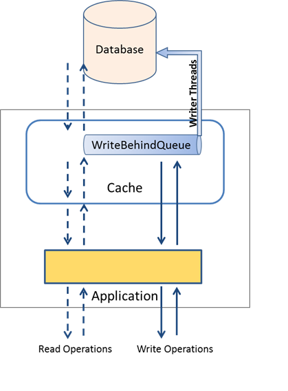

= Write-Behind Caching

There is always a need to improve the performance of application and sometimes part of this task really requires a little
effort as compared to results achieved.
After profiling any application, one can easily single out database as the bottleneck in achieving the next milestone of performance improvement.
Thus it becomes obvious to use a cache to give a push to application’s performance.

Predominantly there are two cache usage patterns – cache aside & cache through.
While cache aside pattern leaves the responsibility of synchronizing SOR(System-Of-Record) which is mainly a database
and the cache to application code, in cache through pattern application code just interacts with the cache level apis.
It is the cache that interacts with database for reads/writes.
The cache through pattern on one hand increases the performance,
on the  other it reduces the code to maintain for database interaction.
Thus it becomes logical to use a cache in cache-through pattern,
but still direct calls from users involve the slowest participant i.e. the database.

The foremost reason for using a cache is to gain performance and scale,
but in cache through pattern the writes still suffers from the latency induced by the database.
To overcome this limit of database slowness, you can use a cache as write-behind cache.
This pattern allows application to let the cache asynchronously update the database,
while application still gets the performance of cache. Rather than writing to the database in the same thread of execution,
write-behind queues the data to be written at a later time.
The cache effectively assumes the role of a database which is fast, while database acts as a backup for the cache.

Write-Behind makes it easy for applications to avoid inconsistent state, since application always reads through the same
cache that it writes through. Provided all database writes are through the cache, consistency is guaranteed.
The unification of loader and writer interfaces enables us to enforce it to some extent.
When a cache is configured for read-through, it doesn’t make any sense for that cache to not be write-through.
All the reads and writes should happen through the cache. With disjoint loaders and writers as in previous versions,
mis-configurations are possible where a user might configure one and not the other.
With a unified loader-writer interface we avoid such risks and helps the cache to provide guaranteed consistency in all cases.
The unified `CacheLoaderWriter` interface enables more control over the reader/writer threads,
which in turn helps cache to provide guaranteed consistency in all cases.

=== Configuring Write-Behind Caches

Let’s try to configure a write behind cache.

[source,java,indent=0]
----
 Cache<Long, String> writeBehindCache = cacheManager.createCache("writeBehindCache",
    CacheConfigurationBuilder.newCacheConfigurationBuilder(Long.class, String.class, ResourcePoolsBuilder.heap(10))
        .withLoaderWriter(new SampleLoaderWriter<Long, String>(singletonMap(41L, "zero"))) // <1>
        .add(WriteBehindConfigurationBuilder
            .newBatchedWriteBehindConfiguration(1, TimeUnit.SECONDS, 3)// <2>
            .queueSize(3)// <4>
            .concurrencyLevel(1) // <5>
            .enableCoalescing()) // <6>
        .build());
----

The above code snippet shows us to create a cache in Ehcache 3.
Obviously, `CacheConfigurationBuilder` is required to build the configuration for Cache.
Following are the configuration parameters for write-behind configuration :-

 . The prerequisite is to have the cache configured with a loader-writer. An implementation of `CacheLoaderWriter` is required for that.

 . Once we have CacheLoaderWriter configured, we can add a `WriteBehindConfiguration` using `WriteBehindConfigurationBuilder`.
    You can either use a batched configuration or non-batched configuration.
    In a non-batched write-behind cache, the single updates are done to database using `CacheLoaderWriter` api.

 . Batching :– Databases are very slow for single updates, but a major performance gain is achieved if the updates are batched.
    The ability to batch the updates increases the performance many fold for databases.
    Based on the load your database can take and the application write rate, the batch size can be configured.
    When batching is enabled `xxxAll` methods on `CacheLoaderWriter` interface are invoked,
    so application developers are expected to make batched updates/reads to the database for maximum performance gain.

 . Concurrency :- You can increase the number of write-behind queues so that cache can parallelly write to the database.
    For write heavy caches, sharding the write behind queues can help in avoiding back pressure to the cache write operations.
    Thus, even if the database is very slow, the write to cache can still be performed without compromising latency.

 . Coalescing – Enabling this consolidates writes to create fewer updates.
    For example, a value in a database row is updated by 5 writes, incrementing it from 10 to 20 to 31 to 40 to 45.
    Using coalesce, the 5 transactions are replaced by one to update the value from 10 to 45,
    thus saving number of effective writes to the database. This provides a major benefit in offloading the database,
    which is one of the big drivers for using a cache.

=== How does it work?

Now we have a cache configured as write-behind cache, let’s try to understand how it works.
Write-Behind solves the problem of database latency.
As you see in below diagram, all the writes are getting queued rather than doing updates to the database.
Thus the application automatically offloads the database in use.
Since the slowest participant is eliminated in the write calls, applications get noticeable performance boost.
Writer threads are responsible for writing to the database using the CacheLoaderWriter configured.

Now this leads to some obvious questions about write-behind.
What is the maximum size to which the queue can grow?
What happens when queue reaches its limit?
When exactly do the write-threads perform the writes to the database?

The maximum size of the queue is determined based on the configuration.
The writer thread will write the whole queues after it is full.
If the write operation rate is very high and queue is full,
then the next write operation will block until the queue is flushed to the database.

In case the queue size is large, or there are not enough writes to the database,
the write-behind threads will only wait for configured maxDelay time before the queue is full,
until the available updates in the queue will be flushed to database rather than waiting endlessly for queue to get full.
This ensures all the changes are flushed to database as early as possible, which might get lost if application crashes.

The reads in write behind caches provide far greater guarantee against inconsistency between cache and
database as compared to previous versions of ehcache.
All the reads first try to get the most recent update for that key from the write-behind queue(if any)
and return the corresponding value. Else the requests are served from the database.

=== Limitations

As you would have noticed, it’s been told always that write-behind keeps cache and database in sync,
provided no one else writes to the database.

But what if someone is writing to the cache externally?
What if we are integrating it with some legacy application which is accessed by different applications?
And we all know that this is not an ideal world.

Write-behind cache can still be used in these kind of scenarios, but with little more intelligence fed into cache.
Apart from write-behind, we have to rely in expiry feature of cache to help us maintain data freshness in the cache.
This requires knowledge about the application usage and data update pattern.
By keeping an eye on how frequently data is updated in the database, we can set an expiry for the cache.
For example, the legacy database is updated every 10 mins, then the cache can be configured to expire every 10 mins or even less.
So even if the database gets updated from other source, the stale data in cache will get expired resulting in fresh load of data in cache.
This reduces the chances of reading stale data from cache.
